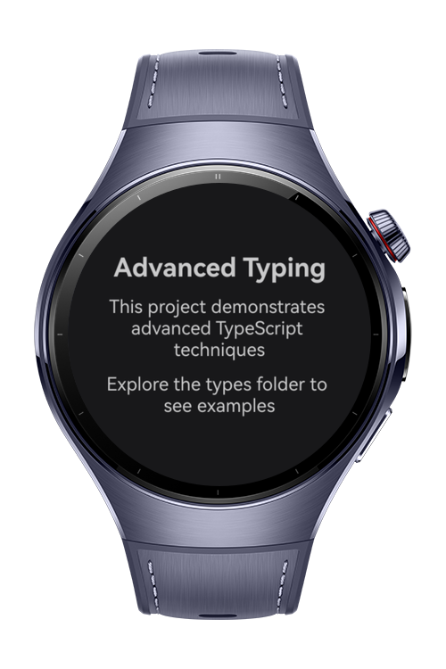

> **Note:** To access all shared projects, get information about environment setup, and view other guides, please visit [Explore-In-HMOS-Wearable Index](https://github.com/Explore-In-HMOS-Wearable/hmos-index).

# How to Use Advanced Typing Patterns in ArkTS Effectively

Advanced Typing Showcase is a reference project designed to demonstrate powerful and expressive type-level programming
techniques in ArkTS.

It serves as a curated playground for developers to explore advanced TypeScript concepts such as branded types,
conditional types, mapped types, template literal types, and deep transformations — all within the context of a
realistic user domain.

The project emphasizes type safety, domain modeling, and maintainable code architecture, offering a hands-on example of
how to leverage TypeScript’s type system to build robust and scalable applications.

# Preview

<p align="left">
  
</p>

# Use Cases

Ideal for developers seeking to:

* Learn and apply advanced TypeScript techniques in a real-world HarmonyOS project
* Understand how to model domain-specific constraints using branded types and type guards
* Explore conditional and mapped types for form validation, API responses, and field state management
* Use template literal types to enforce naming conventions across events, endpoints, and cache keys
* Build a type-safe user service layer with clear separation of concerns and strong typing guarantees

# Tech Stack

- **Languages**: ArkTS, Typescript
- **Frameworks**: HarmonyOS SDK 5.0.2(14)
- **Tools**: DevEco Studio Vers 5.1.0.820

## Directory Structure

```
entry/src/main/ets/
├───entryability
│       EntryAbility.ets
├───entrybackupability
│       EntryBackupAbility.ets
├───types
│       branded-types.ts
│       conditional-types.ts
│       mapped-types.ts
│       user-types.ts
│       utility-types.ts
├───pages
│       Index.ets
└───
```

# Constraints and Restrictions

## Supported Devices

- Huawei Watch 5

# LICENSE

Advanced Typing is distributed under the terms of the MIT License.
See the [LICENSE](/LICENSE) for more information.